<div align="center">

# OmniJev

**An omni-modal Jev · 全模态 Jev**

*One forward pass, zero generated tokens: typed questions about images, videos, screens and robot scenes, answered with calibrated probabilities.*

[](https://omnijev.net/)
[](https://huggingface.co/tinnel123/OmniJev)
[](LICENSE)

**Beijing Zhongguancun Academy · Institute of Automation, Chinese Academy of Sciences · Zevo**

[Website](https://omnijev.net/) · [Try it online](https://omnijev.net/try.html) · [Weights](https://huggingface.co/tinnel123/OmniJev) · [中文文档](README_zh.md)

</div>

---

## What it can do

OmniJev is a model we trained end to end — not the Jev API with somebody else's model behind it. About **270,000 decision records and 1.3 million typed questions** across web and phone operation, robot episodes (simulated and real), video events, real-time games, gestures, hazards and sounds.

A 4B model that **sees images and video** and makes decisions about them: **operate phones and computers**, **play games in real time**, **control robots**, **monitor camera feeds** (hazards, gestures, events). It reads the picture together with your question and any text context, answers with **calibrated probabilities** instead of generated text, and can say *none of the above*.

## What it is

OmniJev is a *System One* decision model. You do not prompt it for text; you give it a state (images, video frames, screenshots, a camera feed, optional context) and a set of **typed questions**, and it returns a probability distribution for every question in **one forward pass with 0 generated tokens**:

| type | asks | returns |
|---|---|---|
| `choice` | which of these options (or none of them)? | a probability for every option, `abstain` = P(none of the above), the chosen key |
| `noul` | is this statement true of the state? | a calibrated probability |
| `score` | how far along an ordered scale? | a level and its probabilities |

Twelve questions about the same screenshot cost about as much as one. Options may also be **regions of the image** (`box: [x1, y1, x2, y2]`, coordinates in 0–1000), so "which element / which cell / where is the hazard" are ordinary choice questions. A video is sampled into 16 timestamped frames, which is exactly what the model sees.

## Released models

Three sizes, one code base (`mso.infer`), one API, all Apache-2.0, all on Qwen3.5 backbones:

| model | backbone | weights | download |
|---|---|---|---|
| **OmniJev-4B** | Qwen3.5-4B | [tinnel123/OmniJev](https://huggingface.co/tinnel123/OmniJev) · mirror [tinnel123/OmniJev-4B](https://huggingface.co/tinnel123/OmniJev-4B) | `hf download tinnel123/OmniJev --local-dir ckpt` · `hf download Qwen/Qwen3.5-4B --local-dir base` |
| **OmniJev-2B** | Qwen3.5-2B | [tinnel123/OmniJev-2B](https://huggingface.co/tinnel123/OmniJev-2B) | `hf download tinnel123/OmniJev-2B --local-dir ckpt` · `hf download Qwen/Qwen3.5-2B --local-dir base` |
| **OmniJev-0.8B** | Qwen3.5-0.8B | [tinnel123/OmniJev-0.8B](https://huggingface.co/tinnel123/OmniJev-0.8B) | `hf download tinnel123/OmniJev-0.8B --local-dir ckpt` · `hf download Qwen/Qwen3.5-0.8B --local-dir base` |

Every example below works for all three: `MSO1("ckpt", "base")` picks the right path from the checkpoint. `pip install fla-core` is optional and turns on the fast linear-attention kernels.

## What it does

Every clip below is a held-out episode the model never saw; every clock is a measured latency.

<table>
<tr>
<td width="50%">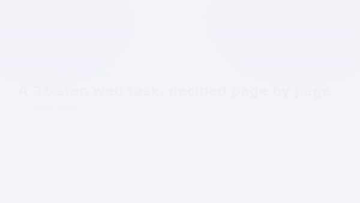<br><sub><b>A 21-step web task, page by page</b> — on every page the model picks the element, the operation, whether this is the last step and how far along the task is.</sub></td>
<td width="50%">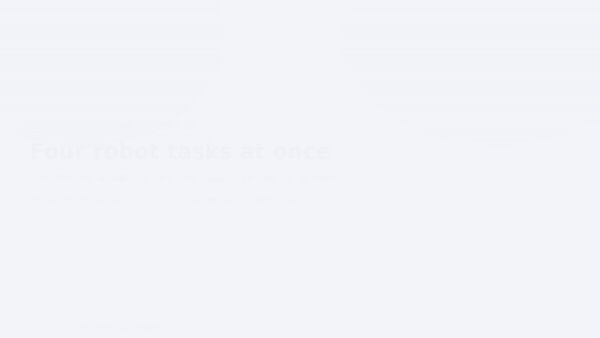<br><sub><b>Four robot tasks at once</b> — four LIBERO-10 episodes at video speed; every frame decides the sub-task, the gripper's next direction, grasp now, holding, first stage done.</sub></td>
</tr>
<tr>
<td>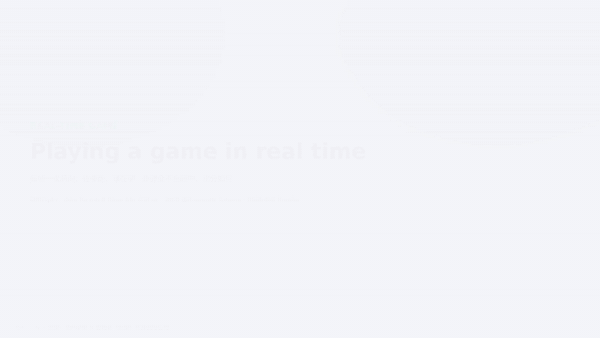<br><sub><b>Playing a game in real time</b> — paddle direction, next ball cell, bomb about to hit, score. One pass per frame, no search, no planner.</sub></td>
<td>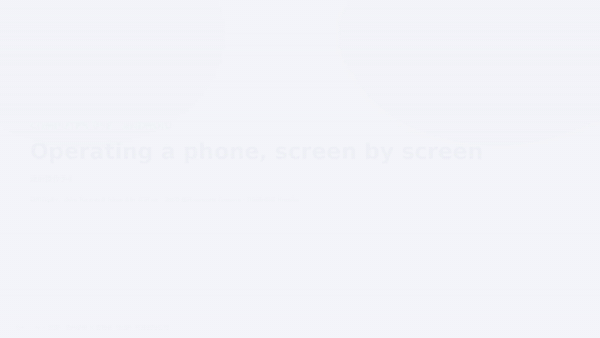<br><sub><b>Operating a phone, step by step</b> — which action to perform, how irreversible it is, whether the screen shows an error dialog.</sub></td>
</tr>
<tr>
<td>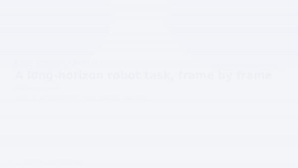<br><sub><b>A long-horizon robot episode</b> — 276 frames of a two-stage manipulation task: instruction, sub-task, direction, grasp, holding, first stage done.</sub></td>
<td>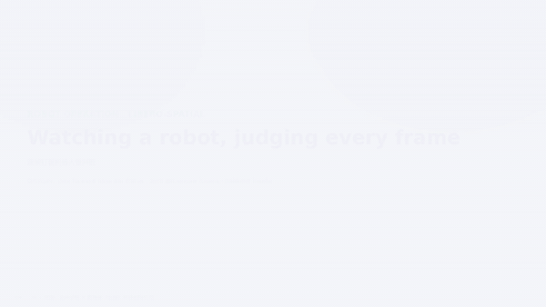<br><sub><b>Watching a robot, judging every frame</b> — five decisions per frame; the amber tick on the rail is the real grasp.</sub></td>
</tr>
<tr>
<td>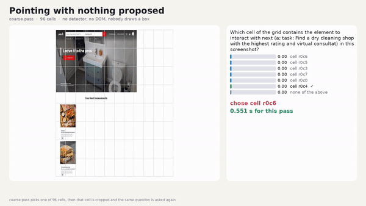<br><sub><b>Pointing on a grid, no boxes drawn by anyone</b> — a 96-cell grid over screenshots and photos; the model picks the cell, zooms in, picks again.</sub></td>
<td>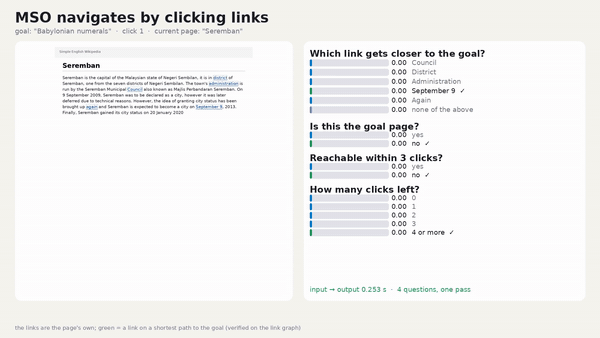<br><sub><b>Navigating link by link toward a target page</b> — which link to follow at each hop, a probability on every candidate, stop when arrived.</sub></td>
</tr>
<tr>
<td>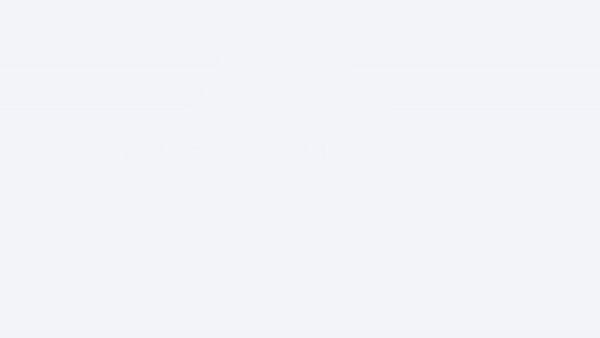<br><sub><b>Watching a camera feed for danger</b> — fire or smoke, what kind of hazard, how urgent, which region. The alarm bar is the model's own probability.</sub></td>
<td><br><sub><b>Gesture control</b> — a hand in front of a camera becomes a device command, fired only when the model is confident enough.</sub></td>
</tr>
<tr>
<td><br><sub><b>Judging what happened in a video</b> — did the event happen, in which frame it starts, is the person still in view, what is being done.</sub></td>
<td>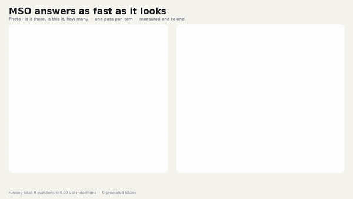<br><sub><b>Ten held-out items, one stopwatch</b> — a photo, a phone screen, a chess board, a robot view, a whole video; the clock runs exactly as long as the model took.</sub></td>
</tr>
<tr>
<td colspan="2">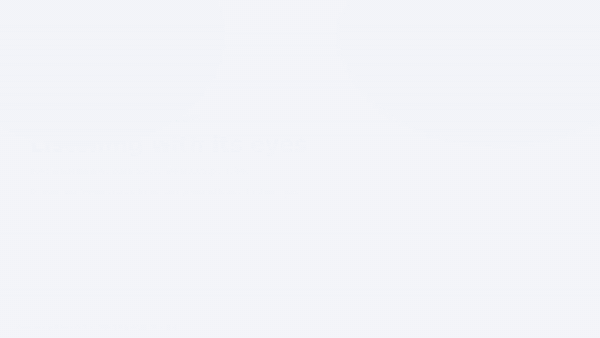<br><sub><b>Listening by looking</b> — five seconds of sound drawn as a spectrogram and a waveform: which sound it is, whether a person made it, whether it contains a sharp burst, how loud. <a href="docs/media/audio.mp4">The clip with the actual audio</a> is next to it in the repository.</sub></td>
</tr>
</table>

## Results

Held-out accuracy of **OmniJev-4B** (Qwen3.5-4B) on the exact serving path, next to its own backbone answering the same questions zero-shot, the released **OmniJev-2B** and **OmniJev-0.8B**, and a **plain-SFT baseline** — the same 0.8B backbone fine-tuned the ordinary way to write the answer as text, scored by an LLM judge, shown for the five families it was trained on. ECE is the calibration error of OmniJev-4B with the served temperatures.

| benchmark (held-out) | n | 0.8B zero-shot | 0.8B plain SFT | OmniJev-0.8B | OmniJev-2B | 4B zero-shot | OmniJev-4B | ECE ↓ |
|---|---|---|---|---|---|---|---|---|
| LIBERO-10 robot decisions | 1504 | 0.551 | 0.247 | 0.771 | 0.724 | 0.299 | **0.807** | 0.031 |
| Mind2Web test (task / website / domain) | 1500 | 0.401 | 0.193 | 0.596 | 0.631 | 0.303 | **0.733** | 0.038 |
| Grid pointing, 96 cells (web) | 1500 | 0.384 | – | 0.474 | 0.625 | 0.421 | **0.737** | 0.021 |
| Self-built event-timing questions (videos from the Charades-STA training set) | 1500 | 0.390 | 0.363 | 0.811 | 0.826 | 0.543 | **0.859** | 0.021 |
| Catch game frames | 1504 | 0.409 | 0.383 | 0.661 | 0.728 | 0.151 | **0.870** | 0.016 |
| HaGRID gestures + fire/smoke/weapons | 1500 | 0.529 | 0.620 | 0.969 | 0.984 | 0.683 | **0.987** | 0.009 |
| OK-VQA answer pool | 1500 | 0.793 | – | 0.656 | 0.765 | **0.860** | 0.809 | 0.021 |
| LongVideoBench val | 500 | 0.410 | – | 0.486 | 0.502 | **0.585** | 0.582 | 0.073 |
| Long video / planning / spatial | 1511 | 0.390 | – | 0.494 | 0.529 | 0.486 | **0.602** | 0.072 |
| Mixed decision set (self-built): regions, existence, phone, chess, short video | 1491 | 0.545 | – | 0.604 | 0.623 | 0.582 | **0.661** | 0.079 |
| Wiki navigation | 1500 | 0.414 | – | 0.659 | 0.667 | 0.336 | **0.706** | 0.030 |
| Real-robot MUTEX | 1500 | 0.442 | – | 0.681 | 0.687 | 0.267 | **0.749** | 0.022 |
| Atari human play | 1500 | – | – | **0.707** | 0.691 | 0.332 | 0.703 | 0.040 |
| Snake | 1500 | – | – | 0.727 | 0.763 | 0.449 | **0.833** | 0.048 |
| Gomoku | 1500 | – | – | 0.694 | 0.669 | 0.154 | **0.696** | 0.021 |
| Chess (local candidate moves) | 1500 | – | – | 0.603 | 0.609 | 0.166 | **0.611** | 0.051 |
| AndroidControl phone operation | 1502 | – | – | 0.634 | 0.668 | 0.291 | **0.734** | 0.037 |
| ESC-50 sounds (spectrogram) | 795 | – | – | 0.473 | 0.514 | 0.347 | **0.525** | 0.051 |
| RoboArena real-robot rollouts | 1503 | – | – | – | – | 0.336 | **0.628** | 0.019 |
| JAT racing / paddle games (Enduro, Skiing, Pong) | 1500 | – | – | – | – | 0.259 | **0.589** | 0.061 |
| Super Mario Bros | 735 | – | – | – | – | **0.464** | 0.339 | 0.184 |
| POPE object hallucination (yes/no) | 9000 | – | – | – | – | 0.867 | **0.902** | 0.007 |

**How to read the two columns.** POPE and LongVideoBench are held out completely: no data from either ever entered training, so the gap there is generalisation. Mind2Web uses the dataset's own train split for training and its official test splits here. Every other row is a question pool we built ourselves, with 8 % of the rows held out by a hash of the row id. The backbone column is zero-shot on all of them, so outside the first two rows the gap measures what training on that family buys, not a like-for-like benchmark.

**Three rows were measured on an incomplete input.** RoboArena, JAT and Super Mario Bros come from families whose records carry more than one still, and until now the serving path encoded only the first of them, so those questions were in effect answered from a single frame. The fix and re-measured numbers ship together in the next release; we are leaving the figures above as they were measured rather than quietly restating them.

**ECE** (expected calibration error) says whether the probabilities can be trusted: it is the average gap between the confidence the model states and how often it is actually right. An ECE of 0.05 means that when the model says "90 %" it is right about 85–95 % of the time; 0 would be perfect, and lower is better. A generative model that only prints an answer has no such number. The values above use the temperatures shipped in `head_meta.json`.

**Latency** (one idle NVIDIA A800-SXM4-40GB, the serving path, a 768-token image budget, all questions about the same image in one request; median of 12 runs, same card and same script for all three: `bench/speed_bench.py`, 12 fixed questions on one image):

| model | 1 question | 3 questions | 6 questions | 12 questions | per question (12) |
|---|---|---|---|---|---|
| OmniJev-4B | 294 ms | 292 ms | 344 ms | 436 ms | 36.3 ms |
| OmniJev-2B | 217 ms | 220 ms | 243 ms | 277 ms | 23.1 ms |
| OmniJev-0.8B | 216 ms | 216 ms | 218 ms | 236 ms | 19.6 ms |

All three are Qwen3.5 backbones on the same prefix-branch path, so latency grows with size (216 ms → 294 ms for one question). Packing several questions into one request drops the cost per question from 294 ms to 36.3 ms, because the image is encoded once. This is the first time all three rows were measured on one card; the numbers this page carried before came from different hardware and were not comparable row to row.

## Apple Silicon (MPS) port

This fork selects MPS automatically when CUDA is unavailable and `torch.backends.mps.is_available()` is true. The MPS path uses float32 and PyTorch's native Qwen3.5 linear-attention implementation; the optional CUDA-only `fla-core` Triton kernels are not enabled. Expect higher memory use and lower throughput than CUDA; choose the 0.8B checkpoint first. The published latency and accuracy measurements above are **not** MPS measurements.

```bash
uv venv .venv && uv pip install --python .venv/bin/python -r requirements.txt
hf download tinnel123/OmniJev-0.8B --local-dir ckpt
hf download Qwen/Qwen3.5-0.8B --local-dir base
.venv/bin/python mso/infer.py --ckpt ckpt --model base --image image.jpg \
  --questions '{"present":{"type":"noul","instructions":"There is a person in the image."}}'
```

The checkpoint and backbone are downloaded separately and are not included in this repository. Preserve the original [Apache-2.0 license](LICENSE) and check the backbone's own license before redistributing weights.

## Quick start

```bash
git clone https://github.com/tinnel123666888/OmniJev && cd OmniJev
python -m venv venv && ./venv/bin/pip install -r requirements.txt     # torch, transformers>=5, pillow

hf download tinnel123/OmniJev --local-dir ckpt                       # the OmniJev weights
hf download Qwen/Qwen3.5-4B --local-dir base               # the backbone (or symlink a local copy)
```

**An image.** Questions are a map `id -> question`; the answers come back under the same ids.

```python
from mso.infer import MSO1

m = MSO1("ckpt", "base")
answers = m.system_one(
    {"images": ["screen.png"]},
    {"op":   {"type": "choice", "instructions": "Which operation comes next?",
              "criteria": {"click": "tap an element", "type text": "", "scroll": ""}},
     "risk": {"type": "score",  "instructions": "How irreversible is the next action?",
              "levels": ["harmless", "needs care", "irreversible"]},
     "err":  {"type": "noul",   "instructions": "This screen shows an error dialog."}})
# answers["op"]   -> {"choice": "click", "probabilities": {"click": 0.81, ...}, "abstain": 0.02, "confidence": 0.81}
# answers["risk"] -> {"score": "needs care", "probabilities": {...}, "confidence": 0.7}
# answers["err"]  -> {"noul": 0.01}
```

**A video.** `video_state` samples 16 timestamped frames into one picture (ffmpeg and ffprobe must be on PATH); the model then judges the whole clip.

```python
from mso.video import video_state

answers = m.system_one(
    video_state("clip.mp4"),                                  # writes clip.mosaic.jpg next to the clip
    {"happened": {"type": "noul",   "instructions": "The person opens the door."},
     "doing":    {"type": "choice", "instructions": "What is the person doing?",
                  "criteria": {"cooking": "", "cleaning": "", "reading": "", "eating": ""}},
     "progress": {"type": "score",  "instructions": "How much of the action is shown?",
                  "levels": ["none of it", "the beginning", "most of it", "all of it"]}})
```

**Text context.** Put it in front of the instructions; the model reads it together with the picture (the served API does the same with `state.text`).

```python
task = "Task: book a table for two at 7 pm on the restaurant's website."
answers = m.system_one(
    {"images": ["page.png"]},
    {"op":   {"type": "choice", "instructions": task + "\nWhich operation comes next?",
              "criteria": {"click": "tap an element", "type text": "", "select": "", "scroll down": ""}},
     "done": {"type": "noul",   "instructions": task + "\nThe task is finished."}})
```

**Regions.** A choice option can be a region instead of a name: `"options": [{"key": "a", "region": {"box": [120, 40, 380, 90]}}, ...]` (0–1000). `mso/templates.py` has ready-made question sets for browsers, phones, robots, games and grids (`templates.questions("libero", instruction=...)`), and `mso/infer.py` is also a CLI (`--ckpt --model --image --questions`).

## How it was trained

OmniJev starts from an open 4B vision-language model (Qwen3.5-4B) and is trained by us end to end to *decide* instead of *write*: a small decision layer reads the answer to every question straight off the model's probabilities, so nothing is generated and nothing can go off-schema. The training set is **about 270,000 decision records and 1.3 million typed questions** built from public datasets and our own renders — web and phone operation, robot episodes and real-robot rollouts, real-time and board games, everyday-action and long video, gestures and hazards, and sounds drawn as spectrograms — and every number we publish is measured on held-out rows the model never saw. Training is a supervised stage under **proper scoring rules**, which reward probabilities that are not only right but honest about their uncertainty; a final calibration on held-out data is what makes a threshold such as "act only above 0.8" meaningful. The options are shown to the model in a way that makes the answer independent of their order. Weights: [`tinnel123/OmniJev`](https://huggingface.co/tinnel123/OmniJev) (~290 MB on top of the backbone).

## License and citation

**Apache-2.0** (see [LICENSE](LICENSE)) for the code and the weights; the backbone keeps its own license.

```bibtex
@misc{omnijev2026,
  title  = {OmniJev: an omni-modal System One decision model},
  author = {Xu, Tianrun and Fan, Hongbang and Lin, Jiahao and Zhu, Zilin and Diao, Zhenxin and Guo, Longteng and Liu, Jing},
  note   = {Beijing Zhongguancun Academy; Institute of Automation, Chinese Academy of Sciences; Zevo},
  year   = {2026},
  url    = {https://github.com/tinnel123666888/OmniJev}
}
```


## Team and contact

OmniJev is developed jointly by **Beijing Zhongguancun Academy**, the **Institute of Automation, Chinese Academy of Sciences** and **Zevo**.

Main contributors

- Tianrun Xu (徐添润) · Core Developer
- Hongbang Fan (范红榜)
- Jiahao Lin (林佳豪)
- Zilin Zhu (朱子林)
- Zhenxin Diao (刁镇薪)
- Longteng Guo (郭龙腾) · Project Lead
- Jing Liu (刘静) · Corresponding Author

Contact — academic exchange and collaboration: s-xtr24@bza.edu.cn

<div align="center"><sub>北京中关村学院 · 中国科学院自动化研究所 · 智进化 · <a href="https://omnijev.net/">omnijev.net</a></sub></div>
